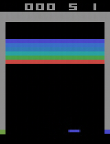

# Project Report

## 1. Why did you pick the particular project?

I found the project genuinely exciting. World models are fascinating, VQ-VAE is super cool, and the idea of a network having an imagination really caught my attention. It felt like the kind of project that would be both fun and challenging to work on.

## 2. If you had more compute/time, what would you have done?

Due to memory constraints while saving the data, I could only generate 10k data samples, which I believe are part of the reason why my approach didn't perform as well as expected. With more compute and time, I would first try to improve the current architecture I tried with RNN and based on the results, further experiment with transformers. I would also try to optimize how data is collected and saved. 

## 3. What did you learn in the project?

This was my first time working with VQ-VAE, so that was a major learning experience. I also gained a much deeper understanding of world models and how they can be trained to simulate environments. Overall, it was a great introduction to generative modeling and learning dynamics in agent-based systems.

## 4. What surprised you the most?

The core idea of the project was incredibly surprising to me. Before this, I wasn’t familiar with Genie 2, and I was amazed to learn that a complete game environment could be generated from just a single prompt image. Realizing that something so complex could be scaled down and replicated on a smaller level really blew my mind. That "WOAH" moment is what made me want to contribute. Even though my implementation didn’t go exactly as planned, it was still a valuable experience.

## 5. If you had to write a paper on the project, what else needs to be done?

The model needs to be further refined and tested more rigorously. I would also want to explore applying the architecture to different games to test its generalization capabilities. That, along with improved training procedures and larger datasets, would be necessary steps toward a publishable result.

## What did I add to the project?

While going through the gameplay demo video initially, I noticed a glitch in the game. The ball, after bouncing on the slider, switched its direction in the air. Intuitively, I thought that it could be due to the lack of information during frame generation. Since only one frame is provided along with action of slider, there could still be different directions the ball could go in, which could be why the ball switched its direction mid air. As a solution, I thought of passing two frames to generate next frame in order to provide more context to the model. However, the gameplay did not improve as much as I expected it to. This could be due to a smaller dataset. Since I could not collect larger datasets for the action-latent mapping due to memory constraints, I decided to find other ways to improve the performance. This is when I thought of using RNNs instead of a simple MLP during mapping as RNNs are capable of learning temporal differences better. However, even with this approach, I was unable to get good results. Despite changing multiple hyperparameters, the model's accuracy stayed stuck at 70-71%. This could be due to smaller dataset, or the short sequence length (=3) I was passing to the RNN. Post submission, I will dig deeper and try to get the RNN experiment at least running for my own sanity :)

## Demo

Here's the outcome of what I tried with 3 frames

For my RNN experimentation, the ball has unfortunately disappeared from the game environment. 